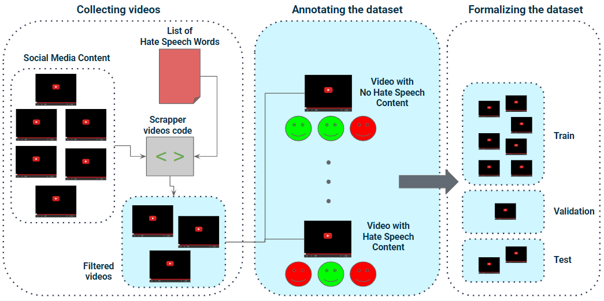

# A Dataset for Hate Speech Detection in Videos 

This repository hosts the documentation of the construction of our **Mexican Spanish Video Dataset**. 
A dataset aimed to be used for the **hate speech detection task**.

- [A Dataset for Hate Speech Detection in Videos](#a-dataset-for-hate-speech-detection-in-videos)
   - [Summary](#summary)
   - [Getting Started](#getting-started)
   - [Citation](#citation)
   - [Acknowledgments](#acknowledgments)
   - [Media Coverage](#media-coverage)

# Summary
The hate speech detection task has been gaining interest in recent years. Existing methods address the task for English language-based resources. Then, a lack of experimentation in other languages is notable not only by the language itself but also by the limited availability of datasets.

In this regard, we present our _Mexican Spanish Video Dataset_, which is built by collecting YouTube videos with possible hate speech content. 



The built up of the dataset consists of:
- Collecting videos (from YouTube and with possible relation to hate speech content)
   - Segmenting the videos
   - Video segments into batches
- Annotating the dataset 
- Formalizing the dataset 

# Getting Started

## Code Structure
```
├── 1.1 hate speech words lists            # csv files of hate speech related words
├── 1.2 YouTube retrieved videos           # filtering and downloading scripts and videos
│   ├── 1.2.1 YT videos (lists of IDs)     # csv files of lists of filtered YT videos using the hate speech related words lists
│   ├── 1.2.2 YT videos (downloaded)       # directories for the downloaded videos
│   ├── download_videos_youtube.py
│   ├── download_videos_youtube_specific_playlist.py
│   ├── filter_lst_videos_from_youtube.py
│   ├── filter_lst_videos_using_video_seeds.py
├── 2.1 video segments                     
│   ├── 2.1.1 video segments               # directories for the 1-minute segmentations
│   ├── generate_1m_scenes_from_videos.py
├── 3.1 video segments to batches
│   ├── 3.1.1 batch csv files              # csv files with the information of the videos that belong to each batch
│   └── generate_video_batches.py
└── README.md
```

##  1. Collecting the videos 
First, videos are filtered and downloaded from YouTube (YT) platform using a hate speech (HS) related word lists as seeds. Two lists were used:
1. A list based on expressions/terms we should avoid to use inclusive and non-sexist language. This list is based on the _Guía de lenguaje incluyente y no sexista_ published by the _Secretaría de Relaciones Exteriores_ and include 56 words.
2. A list based on terms catalogued as offensive in the mexican context. This list is based on the terms obtained by the _hatebase_ website and includes 29 words.

Second, we manually identified some relevant videos with possible hate speech content from the original filtered and downloaded ones. These relevant videos were used as seeds to retrieve related/similar ones to that type of content. Also, we manually identified YT channels and playlists with possible hate speech content and retrieved some of the available videos.

For the downloaded videos (1.2.2 YT videos (downloaded)):   
- Folders of downloaded videos directly from YouTube using the lists of IDs in 1.2.1 are identified as "dwnld-yt-filtered-videos-from-lst-_hsWordsListName_-_n___-vpw" were n corresponds to the number of videos filtered per word. 
- Folders of relevant videos manually selected from the original downloaded ones that served as seeds to search for similar ones include the _-relevant_ word in their directory name
- Folders of related videos that were retrieved using the relevant ones as seeds include the _-related_ word in their directory name
- Folders that contain the retrieved videos from a manually identified YT channel/playlist are identified with the format "dwnld-yt-_playlist_-_channelName_"

## 2. Video segmentation
Once the videos were retrieved/downloaded it is necessary to segment each one into scenes. In our case, we decided to segment each video into 1-minute length scenes.

## 3. Video segments into batches
A pool of videos 


To build the pool of videos that will be labeled as the dataset only the relevant, related and playlist ones are considered. This because:
- relevant: include videos manually selected from the original filtering from YouTube
- related: include videos retrieved by using the relevant ones as seeds
- playlist: include videos from playlists manually identified from certain YouTube channels
Then, this pool of videos is chunked into batches of n number of videos in order to facilitate the annotation process. These batches are randomly built.
- [x] 3.1 video segments to batches

### 4. Annotating the videos
The annotation webapp built for this project can be accessed through the following link.
- [ ] https://github.com/iltocl/hsdvmi-video-annotation-webapp.git
   
### 5. Formalizing the dataset
- [ ] train (%)
- [ ] test (%)

# Media Coverage
- [Guía de lenguaje incluyente y no sexista, SRE 2023](https://www.gob.mx/sre/documentos/guia-de-lenguaje-incluyente-y-no-sexista?state=published)
- [hatebase website](https://hatebase.org/)
